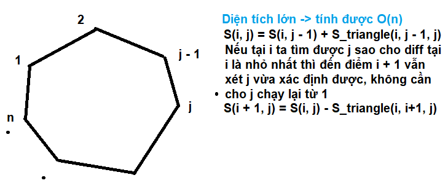

## Giải thích code bài 14

### 1. Đề
Cho đa giác lồi n đỉnh có tọa độ nguyên xi,yi. Các đỉnh được liệt kê ngược chiều kim đồng hồ và không có 3 đỉnh nào thẳng hàng. Chỉ ra một cách kẻ 1 đường chéo đi qua 2 đỉnh và chia đa giác thành 2 phần có diện tích chênh lệch nhau ít nhất.
- Dữ liệu vào
    - Dòng đầu tiên: nn≤10^3
    - Dòng thứ i trong n dòng sau: xi,yixi,yi109.
- Kết quả:
    - Gồm 2 số nguyên là số thứ tự 2 đỉnh được chọn.

### 2. Giải thích

### 3. Độ phức tạp:
- Thời gian: O(n)
- Không gian: O(n)