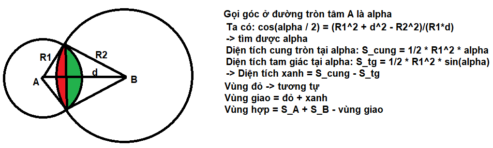

## Giải thích code bài 15

### 1. Đề
Trên mặt phẳng cho 2 hình tròn có cùng bán kính R và tọa độ tâm tương ứng x1,y1 và x2,y2. Tính diện tích phần hợp của 2 hình tròn trên mặt phẳng. Tọa độ tâm và bán kính hình tròn đều là các số nguyên.
- Dữ liệu vào: 
    - Gồm các số nguyên x1,y1,x2,y2,R1≤x1,y1,x2,y2,R≤100
- Kết quả: 
    - Chứa một số thực duy nhất là diện tích phần hợp lấy chính xác 3 chữ số thập phân.

### 2. Giải thích

### 3. Độ phức tạp
- Thời gian: O(1)
- Không gian: O(1)